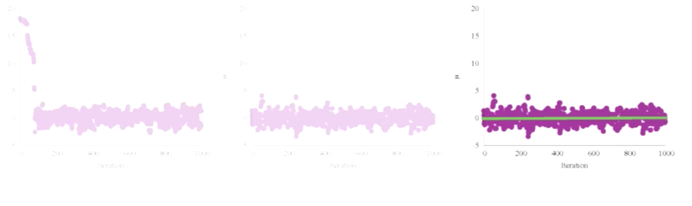
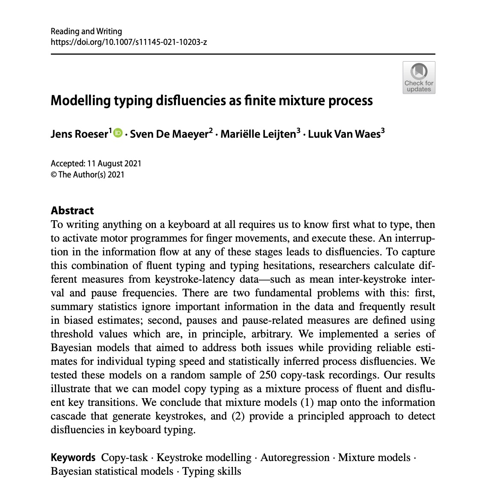

class: center, middle
<style>

.center2 {
  margin: 0;
  position: absolute;
  top: 50%;
  left: 50%;
  -ms-transform: translate(-50%, -50%);
  transform: translate(-50%, -50%);
}

</style>

```{css echo=FALSE}
.right-column{
  padding-top: 0;
}

.remark-code, .remark-inline-code { font-family: 'Source Code Pro', 'Lucida Console', Monaco, monospace;
                                    font-size: 90%;
                                  }


```

```{r, include = FALSE}
library(xaringanthemer)
style_xaringan(link_color = '#002E65')
```


```{r setup, echo = FALSE}
knitr::opts_chunk$set(fig.retina = 3, warning = FALSE, message = FALSE)
```


<div class="my-logo-left">  </div>


# Workshop: Bayesian analyses in R 

.font160[
.SW-greenD[Sven De Maeyer]
]

[University of Antwerp / Faculty of Social Sciences]

.font80[
.UA-red[
13/09/2021
]
]


```{r, include = F, message = F}
library(tidyverse)
library(bayesplot)
library(tidybayes)
library(brms)
library(ggplot2)
library(DT)
library(bayestestR)
library(parameters)
library(see)
library(sjPlot)
library(RColorBrewer)
library(here)
```
---
background-image: url(despicable_me2.jpeg)
background-size: contain
class: inverse

## .yellow[About me]

- University  of Antwerp;  Faculty of Social Sciences; dept. Training and Education Sciences

- phd on methodological issues in research on School Effectiveness

- research on a broad range of topics (e.g. psychometrics, writing research, learning strategies, education for sustainable development, linguistics, speech development of impaired children, ...)

- my main focus shifted recently to Comparative Judgement and Learning from comparisons

- since a year or 2 discovering Bayesian Statistics & `brms`

<br>
<br>
<br>


Blog: https://svendemaeyer.netlify.app/

Twitter: @svawa

github: https://github.com/Sdemaeyer2

---
background-image: url(we_like_you_too.jpg)
background-size: contain
class: inverse, center, bottom


## .green[What about you?]

.black[Who has some experience with Bayesian analyses?]

.black[... with `Stan`?]

.black[ ... with `brms`?]

<br>
<br>
<br>

---
name: topicslide

# Topics

1.   Aims of the workshop & some practical stuff ([let's go there](#aims))

2.   What's Bayesian? ([let's go there](#Whats_Bayesian))

3.   Why .UA-red[`brms`]? ([let's go there](#why_brms))

4.   .UA-red[`brms`] basic example ([let's go there](#brms_example))

5.   Let's get practical: .SW-greenD[the example data] ([let's go there](#example_data))

6.   Let's slightly increase complexity ([let's go there](#add_complexity))

---
class: inverse-green, center, middle
name: aims

# 1.   Aims & practical stuff

.footnote[[<i> get me back to the topic slide</i>](#topicslide)]

---
## My aims  are ...
<br>
<br>
- to give some background on Bayesian statistics without getting too technical (I hope)
- to get you familiar with a basic workflow for a Bayesian analysis making use of .UA-red[ `brms`] and other great packages
- to let you apply what's learned on your data (so it's hands-on)
- to supply you with .UA-red[ `R code`] that may inspire
- to share some great sources

---

## All material is shared...

<br>

On Github there is a dedicated repository where you'll find:

- the Rmarkdown filefor the slides

- saved models from the slides (some take too long to estimate 'live')

- data used for the exercises

<br>

The Github repository can be accessed using the following link:

[https://github.com/Sdemaeyer2/Turku_brms_2021]

<br>

The slides are on my Talks site [https://slides-sdemaeyer.netlify.app/]

---

## Zoom 
<br>
Recordings

<br>

Please ask questions and interfere! Just give a shout! 

<br>

Stuck with some exercises? 

$\rightarrow$ Share your screen and we will try to help

---
##Your own data

Day 2: 

- some dedicated time to apply stuff to your own data
- be prepared:
  - think about some (simple) models (and possible priors...)
  - prepare your data  to avoid a lot of data issues on day 2
  - for the brave: try some modelling at home before day 2

---
name: Prerequisites

##Prerequisites

- be familiar with R
- have `CmdStan` & `cmdstanr` up and running (see https://mc-stan.org/cmdstanr/articles/cmdstanr.html)
- have `brms` installed
- have `tidyverse` installed


I will often use the .SW-greenD[functional programming] style making use of the pipe operator (works if `tidyverse` is loaded):

```{r, eval = F}
A %>% B
```

This reads as .UA-red[take A] and then .UA-red[do B] 

An example:

```{r, eval = F}
c(1,2,3,4,5) %>% mean()
```

reads as .UA-red[create a vector of the values 1, 2, 3, 4 and 5] and then .UA-red[calculate the mean]

Want to learn dplyr by nice GIFS: [hop to this great tweet feed](#tweet_dplyr)
---
class: inverse-green, center, middle
name: Whats_Bayesian

## What's Bayesian inference about?

.footnote[[<i> get me back to the topic slide</i>](#topicslide)]
---
## First things first...

<br>
<br>

What is <b>.SW-greenD[statistical inference]</b> about?

<br>
<br>

In your definition, what is a <b>.SW-greenD[statistical model]</b>?

<br>
<br>

What are <b>.SW-greenD[parameters]</b>?
---
## Frequentist vs. Bayesian inference

.pull-left[
```{r, out.height = "110%", out.width="110%", eval = T, echo = F}
knitr::include_graphics("figures_inferences_NHST.jpeg")
```
]

.pull-right[
```{r, out.height = "110%", out.width="110%", eval = T, echo = F}
knitr::include_graphics("figures_inferences_Bayes.jpeg")
```
]

---

## To get us started...

.left-column[
```{r, out.height = "110%", out.width="110%", eval = T, echo = F}

```
]

.right-column[
- prof. dr. Von Helsing (a famous Vampire Hunter)

- How many Vampires are out there?

- Time for his famous .UA-red[Vampire Test]

- Sample of 200 citizens

- Result: 10.5%  = Vampire

- Ok, but what about the population?
]

---

## What a Frequentist approach can tell us

Make a Confidence Interval for the 10.5%:

- Estimate the sampling error:

  * sampling error: 0.0217

- Calculate upper and lower limit of the 95% CI:

  * lower: 0.0625
  * upper: 0.1475

- Inference:

> In 95% of the samples (of sample size 200) we would get a percentage of vampires varying somewhere between 6.25% and 14.75%

---

## The Bayesian approach

.left-column[
Before Von Helsing gathers data he had no knowledge at all! 

If we visualize this 'prior knowledge' it could look like this.]

.right-column[

```{r, echo = FALSE, warning = FALSE, error = FALSE, fig.width=8, fig.height=6 }
set.seed(1975)

Vamp_data_weinig <- sample(c(TRUE, FALSE), prob = c(0.14, 0.86),
                   size = 20, replace = TRUE)
n_draws = 10000
prior_prop = c(1, 1)
library(tidyverse)
data <- as.logical(Vamp_data_weinig)
data_indices <- round(seq(0, length(data), length.out = min(length(data) + 1, 20)))
proportion_success <- c(0, seq(0, 1, length.out = 100), 1)
dens_curves <- map_dfr(data_indices, function(i) {
    value <- ifelse(i == 0, "Prior", ifelse(data[i], "Vampire", "Not a Vampire"))
    label <- paste0("n=", i)
    probability <- dbeta(proportion_success,
                         prior_prop[1] + sum(data[seq_len(i)]),
                         prior_prop[2] + sum(!data[seq_len(i)]))
    probability <- probability / max(probability)
    data_frame(value, label, proportion_success, probability)
  })

dens_curves$label <- fct_rev(factor(dens_curves$label, levels =  paste0("n=", data_indices )))

dens_curves$value <- factor(dens_curves$value, levels = c("Prior", "Vampire", "Not a Vampire"))

library(purrr)

dens_curves0 <- dens_curves %>% filter(value == "Prior") 

p <- ggplot(dens_curves0, aes(x = proportion_success, y = label,
                               height = probability, fill = value)) 
p +
    ggridges::geom_density_ridges(stat="identity", color = "white", alpha = 0.8,
                                  panel_scaling = TRUE, size = 1) +
    scale_y_discrete("", expand = c(0.01, 0)) +
    scale_x_continuous("Proportion of Vampires") +
    scale_fill_manual(values = hcl(120 * 2:0 + 15, 100, 65), name = "", drop = FALSE) +
    ggtitle(paste0(
      "Prior distribution (before gathering data (so n=0))")) +
    theme_light() +
    theme(legend.position = "top")
```
]
---
## The Bayesian approach

.left-column[

Von Helsing starts testing ...

First tested person is NOT a Vampire!

So, 100% of Vampires is already less probable.

Time to adjust our knowledge
]

.right-column[
```{r, echo=F, warning=F, message=F, error=F, fig.width=8, fig.height=6, fig.retina=3 }

set.seed(1975)

Vamp_data_vol <- sample(c(TRUE, FALSE), prob = c(0.14, 0.86),
                   size = 200, replace = TRUE)

set.seed(1975)

Vamp_data_weinig <- sample(c(TRUE, FALSE), prob = c(0.14, 0.86),
                   size = 20, replace = TRUE)

set.seed(1975)

Vamp_data_zeerweinig <- sample(c(TRUE, FALSE), prob = c(0.14, 0.86),
                   size = 1, replace = TRUE)

prop_model <- function(data = c(), prior_prop = c(1, 1), n_draws = 10000) {
  library(tidyverse)
  data <- as.logical(data)
  # data_indices decides what densities to plot between the prior and the posterior
  # For 20 datapoints and less we're plotting all of them.
  data_indices <- round(seq(0, length(data), length.out = min(length(data) + 1, 20)))
  
  # dens_curves will be a data frame with the x & y coordinates for the 
  # denities to plot where x = proportion_success and y = probability
  proportion_success <- c(0, seq(0, 1, length.out = 100), 1)
  dens_curves <- map_dfr(data_indices, function(i) {
    value <- ifelse(i == 0, "Prior", ifelse(data[i], "Vampire", "Not a Vampire"))
    label <- paste0("n=", i)
    probability <- dbeta(proportion_success,
                         prior_prop[1] + sum(data[seq_len(i)]),
                         prior_prop[2] + sum(!data[seq_len(i)]))
    probability <- probability / max(probability)
    data_frame(value, label, proportion_success, probability)
  })
  # Turning label and value into factors with the right ordering for the plot
  dens_curves$label <- fct_rev(factor(dens_curves$label, levels =  paste0("n=", data_indices )))
  dens_curves$value <- factor(dens_curves$value, levels = c("Prior", "Vampire", "Not a Vampire"))
  
  p <- ggplot(dens_curves, aes(x = proportion_success, y = label,
                               height = probability, fill = value)) +
    ggridges::geom_density_ridges(stat="identity", color = "white", alpha = 0.8,
                                  panel_scaling = TRUE, size = 1) +
    scale_y_discrete("", expand = c(0.01, 0)) +
    scale_x_continuous("Proportion of Vampires") +
    scale_fill_manual(values = hcl(120 * 2:0 + 15, 100, 65), name = "", drop = FALSE,
                      labels =  c("Prior   ", "Vampire   ", "Not a Vampire   ")) +
    ggtitle(paste0(
      "Binomial model - Data: ", sum(data),  " Vampires, " , sum(!data), " Not Vampires")) +
    theme_light() +
    theme(legend.position = "top")
  print(p)
  
  # Returning a sample from the posterior distribution that can be further 
  # manipulated and inspected
  posterior_sample <- rbeta(n_draws, prior_prop[1] + sum(data), prior_prop[2] + sum(!data))
  invisible(posterior_sample)
}

prop_model(Vamp_data_zeerweinig)
```

]
---

## The Bayesian approach

.left-column[
After testing the whole sample of 200 citizens, Von Helsing's knowledge is updated:
]

.right-column[
```{r, echo=F,warning=F,error=F, preview = TRUE, fig.width=8,fig.height=6, fig.retina=3}
Vamp_Posterior <- prop_model(Vamp_data_vol)
```
]
---

## The Bayesian approach

.left-column[
We get a probability for each possible percentage of vampires. 

* plot it in a .UA-red[probability density] plot

* summarize: e.g. 90% most probable values are situated between 7.5% and 14.8%
]

.right-column[
```{r ,echo=F,warning=F,error=F,fig.width=8,fig.height=6, fig.retina=3}
Vamp_Posterior <- data.frame(Vamp_Posterior)
Vamp_Posterior$density_p <- pbinom(Vamp_Posterior$Vamp_Posterior,200,prob = c(0.14, 0.86))
p <- ggplot(Vamp_Posterior, aes(x = Vamp_Posterior)) 
p + geom_density(aes(y = ..density..*(1/10000)),color="darkblue", fill="lightblue",alpha=0.35)+
    theme_light() +
    theme(legend.position = "top") +
    scale_x_continuous("Proportion of Vampires") +
    scale_y_continuous("Density") +
    geom_vline(aes(xintercept=median(Vamp_Posterior)),
            color="darkblue", linetype="dashed", size=1) +
  annotate("label",label = "median = 0.107", x = 0.107, y = 0.001, colour = "darkblue")
```
]

---
## Advantages & Disadvantages of Bayesian analyses
<br>

Advantages:

- Natural approach to express uncertainty
- Ability to incorporate prior knowledge
- Increased model flexibility
- Full posterior distribution of the parameters
- Natural propagation of uncertainty

<br>

Disadvantage:

- Slow speed of model estimation
- Some reviewers don't understand you (<i>"give me the p-value"</i>)

.footnote[[*] Slight adaptation of a slide from Paul Bürkner's presentation available on YouTube  
[https://www.youtube.com/watch?v=FRs1iribZME] ] 

---

## Bayesian Theorem

.pull-left[
```{r, out.height = "50%", out.width="50%", echo = FALSE}
knitr::include_graphics("prior_data_posterior.png")
```
]

.pull-right[

$$
P(\theta|data) = \frac{P(data|\theta)P(\theta)}{P(data)}
$$
<br>

with 

- $P(data|\theta)$ : the .UA-red[likelihood] of the data given our model $\theta$
- $P(\theta)$ : our .UA-red[prior] belief about model parameters 
- $P(\theta|data)$: the .UA-red[posterior] probability about model parameters
]

.footnote[meme from https://twitter.com/ChelseaParlett/status/1421291716229746689?s=20]
---

## Likelihood

.left-column[
  $P(data|\theta)$
  
  sometimes also written as
  
  $L(\theta|data)$
  ]
  
.right-colomn[

<br>

Actually this is our .UA-red[<b>model</b>] part

<br>

with $\theta$ being the model and all parameters in the model

]
---
## Likelihood

.left-column[
Example: 

.SW-greenD[<i>What if we want to model how fast people can run a 1OK?</i>]

```{r, out.height = "80%", out.width="80%", echo = FALSE}
knitr::include_graphics("running.jpg")
```

]

.right-column[

Data = 10 observations (Running times for 10K in minutes)

```{r, echo = FALSE}
RT <- c(
  52,
  54,
  58,
  48,
  41, ## whoow; flying!
  49,
  72,
  53,
  64,
  62)
RT
```

The model (<i>normal distribution</i>):

$y_i \backsim N(\mu, \sigma)$

The parameter values that maximize the likelihood of our data:
.footnotessize[
```{r}
Mean_RT <- mean(RT, na.rm = T)
Mean_RT
Sd_RT   <- sd(RT, na.rm = T)
Sd_RT
```
  ]
]

---

## Prior
.center2[
.SW-greenD[
Expression of our prior knowledge (belief) about probable parameter values as a probability density function
]
<br> <br>
><i>"For Bayesians, the data are treated as fixed and the parameters vary. [...] Bayes' rule tells us that to calculate the posterior probability distribution we must combine a likelihood with a prior probability distribution over parameter values." </i>
<br> (Lambert, 2018, p.88)
]

---

## Prior

.left-column[
Example: 

.SW-greenD[<i>What if we want to model how fast people can run a 1OK?</i>]

```{r, out.height = "80%", out.width="80%", echo = FALSE}
knitr::include_graphics("running.jpg")
```

]

.right-column[

$y_i \backsim N(\mu, \sigma)$

Express our prior beliefs about 

.UA-red[
$\mu$
] 

and 
.UA-red[
$\sigma$
]

.UA-blue[
> .Large[🤔] <i> Please share your thoughts? What are possible values of  the population average and standard deviation for our example?] </i>

]

---

## Prior

.pull-left[
### Uninformative / Vague

When .SW-greenD[objectivity] is crucial and you want <i> .SW-greenD[let the data speak for itself...] </i>

]
.pull-right[
### Informative

When including significant information is crucial 

-   previously collected data
-   results from former research/analyses
-   data of another source
-   theoretical considerations
]

---

## Prior

.left-column[
Example: 

.SW-greenD[<i>What if we want to model how fast people can run a 1OK?</i>]

```{r, out.height = "80%", out.width="80%", echo = FALSE}
knitr::include_graphics("running.jpg")
```

]

.right-column[
<b>Vague priors for $\mu$ </b>

```{r, echo = F, warning=F,error=F,fig.width=7,fig.height=5, fig.retina=3}
X <- seq(0, 200, by = 0.1)

Vague1 <- dnorm(
  X, 
  50,
  20
  )

Vague2 <- dunif(
  X,
  min = 1,
  max = 180
)

data_frame(X, Vague1, Vague2) %>%
  pivot_longer(c(Vague1, Vague2)) %>%
  rename(Prior = name) %>%
  ggplot(aes(x = X, y = value ,color = Prior)) + 
    geom_line() +
    theme_light() +
    theme(legend.position = "top") +
    labs(
      x = expression(mu)
    )

```

]

---

## Say we have following priors

```{r, echo = TRUE}
par(mfrow=c(2,2))
curve( dnorm( x , 50 , 20 ) , from=1 , to=200 ,xlab="mu", main="Prior for mu")
curve( dunif( x , 1 , 40 ) , from=-10 , to=50 ,xlab="sigma", main="Prior for sigma")
```

---
## Calculate the Posterior by hand (aka .UA-red[grid approximation])
.pull-left[
```{r}
# sample some values for mu and sigma
mu.list <- seq(from = 30, 
               to = 90, 
               length.out=200)
sigma.list <- seq(from = 2, 
                  to = 30, 
                  length.out = 200)
post <- expand.grid(mu = mu.list, 
                    sigma = sigma.list)

# Calculate the loglikelihood of the data
# for each parameter value
post$LL <- 
  sapply(1:nrow(post), 
    function(i) sum(
      dnorm(
        RT ,
        mean=post$mu[i] ,
        sd=post$sigma[i] ,
        log=TRUE ) ) )
```

]
.pull-right[
```{r}
# Calculate posterior as product 
# of LL and Prior
# but you see a '+ sign' 
# because we put everything on the 
# log scale 
# (to avoid getting zero's 
#  due to rounding in R)

post$prod <- post$LL + 
  dnorm(post$mu, 50 , 10 , TRUE) + 
  dunif(post$sigma , 1 , 40 , TRUE)

# Re-scale the posterior 
# to the probability scale
post$prob <- exp(post$prod - 
                   max(post$prod)
                 )
```
]

---

## Visualise the posterior distribution

<i> Make a contour plot </i>

.pull-left[

```{r, eval = F}
# Sampling going on
# So for reproducibility

set.seed(1975)

post %>%
  # sample 10000 rows
  # with replacement
  # higher prob higher prob to 
  # be sampled
  sample_n(size = 10000, 
           replace = TRUE, 
           weight = prob) %>%
  
  # create the plot
  ggplot(aes(x = mu, y = sigma)) +
  geom_density_2d_filled() + 
  theme_minimal()
```
]

.pull-right[

```{r, echo = F, eval = T, fig.width=6, fig.height=6}
set.seed(1975)

post %>%
  sample_n(size = 10000, replace = TRUE, weight = prob) %>%
  ggplot(aes(x = mu, y = sigma)) +
  geom_density_2d_filled() + 
  theme_minimal()
```
]

---

## Visualise the posterior distributions

<i> Or sample from posterior and plot simple density plots </i>

```{r}
sample.rows <- sample(1:nrow(post), size=10000, replace=TRUE, prob=post$prob)

sample.mu <- post$mu[sample.rows]
sample.sigma <- post$sigma[sample.rows]
```

.pull-left[

```{r, fig.width=4,fig.height=4}
plot(density(sample.mu),main="mu")
```
]

.pull-right[
```{r, fig.width=4,fig.height=4}
plot(density(sample.sigma),main="sigma")
```
]
---
class: inverse-green, center, middle
name: why_brms

## 3. Why `brms`?

.footnote[[<i> get me back to the topic slide</i>](#topicslide)]
---
## Imagine

A 'simple' linear model

<br>

$$\begin{aligned}
  & RT_{i}  \sim N(\mu,\sigma_{e_{i}})\\
  & \mu = \beta_0 + \beta_1*\text{Weigth}_{i} + \beta_2*\text{Height}_{i} + \beta_3*\text{Age}_{i} + \beta_4*\text{WeeklyTrainingHours}_{i} + \beta_5*\text{Gender}_{i} \\
\end{aligned}$$

<br>

So you can get a REALLY LARGE number of parameters!

---
## Markov Chain Monte Carlo - Why?

Complex models $\rightarrow$ Large number of parameters $\rightarrow$ exponentional number of combinations!

<br>

Posterior gets unsolvable by grid approximation

<br>

We will approximate the 'joint posterior' .SW-greenD[by 'smart' sampling]

<br>

Samples of combinations of parametervalues are drawn

<br>

BUT: .SW-greenD[samples will not be random!]

---
## MCMC - demonstrated

.center2[
Following link brings you to an interactive tool that let's you get the basic idea behind MCMC sampling:

https://chi-feng.github.io/mcmc-demo/app.html#HamiltonianMC,standard
]

---

## Side-step: conjugate priors

Some prior probability distributions can be <i>'more easely'</i> combined with a certain likelihood!

These are called .SW-greenD[<b>conjugate</b>] priors

<b>PRO: </b>

You can actually analytically calculate the posterior. 
So: no need for all the sampling and approximation of the posterior.

A list of conjugate likelihood-prior pairs: https://en.wikipedia.org/wiki/Conjugate_prior

<b>BUT: </b>
><i>"Simplicity comes with a cost! In most real-life examples of inference, the contraint of choosing likelihood-prior conjugate pairs is too restrictive and can lead us to use models that inadequately capture the variability in the data. (Lambert, 2018, p. 209)"

---
## Software

<br>

- different dedicated software/packages are available: JAGS / BUGS / Stan

<br>

- most powerful is .UA-red[Stan]! Specifically the *Hamiltonian Monte Carlo* algorithm makes it the best choice at the moment


<br>


- .UA-red[Stan] is a probabilistic programming language that uses C++ 

---

## Example of Stan code

.scriptsize[
```{r echo = F}
load(here("Models", "Model_math_naive.R"))
stancode(Model_math_naive)
```
]
---


---
class: inverse-green, center, middle
name: brms_example

## 4. `brms` basic example

.footnote[[<i> get me back to the topic slide</i>](#topicslide)]
---

## `brms` syntax
Very very similar to `lme4` and in line with typical R-style writing up of a model ...
.pull-left[
`lme4`

```{r, eval = FALSE}
Model <- lmer(
  y ~ x1 + x2 + (1|Group),
  data = Data,

  ...
  
)
```
]


.pull-left[
`brms`

```{r, eval = FALSE}
Model <- brm(
  y ~ x1 + x2 + (1|Group),
  data = Data,
* family = "gaussian",
* backend = "cmdstanr"
  
  ...
)
```
]

Notice: 

- `family = "gaussian"` indicates the "likelihood" function we will use
- `backend = "cmdstanr"` indicates the way we want to interact with Stan and C++

---

## Let's retake the example on running
.left-column[
Example: 

.SW-greenD[<i>What if we want to model how fast people can run a 1OK?</i>]

```{r, out.height = "80%", out.width="80%", echo = FALSE}
knitr::include_graphics("running.jpg")
```

]

.right-column[
The simplest model looked like:

$$
RT_i \sim N(\mu,\sigma_e)
$$

In `brms` this model is:

```{r echo = TRUE, eval = FALSE}
# First make a dataset from our RT vector
DataRT <- data_frame(RT)

Mod_RT1 <- brm(
  RT ~ 1, # We only model an intercept
  data = DataRT,
  backend = "cmdstanr",
  seed = 1975
)
```

.UA-red[<b>
.Large[🏃]  Try it yourself and run the model ...
</b>
]
]

---

```{r include = FALSE}
Mod_RT1 <- readRDS(here("models", "Mod_RT1.RDS"))
```

```{r, out.height = "60%", out.width="60%", echo = FALSE}

```

---
## But ...
.center2[
```{r, out.height = "50%", out.width="50%", echo = FALSE}
knitr::include_graphics("MCMC_Skeleton.jpg")
```
]
---

## So

For the workshop all models are in the .SW-greenD[models] folder

You can normally read model information with `readRDS`

Here's an example:

```{r}
Mod_RT1 <- readRDS(here("models", "Mod_RT1.RDS"))
```

This model information was saved with the `saveRDS` function:

```{r, eval = FALSE}
saveRDS(Mod_RT1, here("models", "Mod_RT1.RDS"))
```

.footnote[Notice that I use the package `here` allowing me to access files anywhere in the RStudio Projects folder using the `here( )` commando (no fuzz with paths on your computer)]

---

# MCMC = sampling

.left-column[
MCMC results will differ each time run 

<br>

Of course, not a lot if your model is good!

<br>

So, what if you want to be reproducible?

]


.right-column[

```{r echo = TRUE, eval = FALSE}
Mod_RT1 <- brm(
  RT ~ 1, # We only model an intercept
  data = DataRT,
  backend = "cmdstanr",
* seed = 1975 # make sure we get the same results each time :-)
)
```

]

---

## Good old `summary( )` function


```{r, highlight.output = c(10,14) }
summary(Mod_RT1)
```

---

## Samples & chains?

```{r,echo = FALSE, highlight.output = c(5,6) }
summary(Mod_RT1)
```

<i>By default `brms` sets .SW-greenD[4 chains of 2000 iterations] of which .SW-greenD[1000 iterations/chain are warm-up] </i>

---

## Samples & chains: what are 'burn-in' iterations

.center2[
```{r, out.height = "100%", out.width="100%", echo = FALSE}

```
]

---

## Samples & chains: what are 'burn-in' iterations

.center2[
```{r, out.height = "100%", out.width="100%", echo = FALSE}

```
]

---

## Samples & chains: what are 'burn-in' iterations

.center2[
```{r, out.height = "100%", out.width="100%", echo = FALSE}

```
]

---

## Good ald `plot( )` function
.pull-left[
```{r,fig.width=6, fig.height=6 }
plot(Mod_RT1)
```
]
.pull-right[

.UA-red[Left panel]

the posterior distributions (<i>later we will see other more informative ways to plot the information in the posterior</i>)

.UA-red[Right panel] 

the convergence of the each parameter 

$\rightarrow$ should look like a caterpillar


```{r, out.height = "50%", out.width="50%", echo = FALSE}
knitr::include_graphics("catterpillar.jpeg")
```

]

---

## Model Convergence

.pull-left[
```{r, out.height = "99%", out.width="99%", echo = FALSE}
knitr::include_graphics("Vethari_paper.jpg")
```
]
.pull-right[
- $\widehat R$ < 1.015 for each parameter estimate

- at least 4 chains are recommended

- Effective Sample Size (ESS) > 400 to rely on $\widehat R$ 
]

---

## Let's inspect the output again

```{r,echo = FALSE}
summary(Mod_RT1)
```

---
class: inverse-green, center, middle
name: example_data

## 5. Let's get practical: the example dataset

.footnote[[<i> get me back to the topic slide</i>](#topicslide)]
---
## Judging 'argumentative texts'


---

## Procedure

- 26 high school teachers (Dutch) voluntary participated

- each did 10 comparisons of 2 argumentative texts from 10th graders

- 3 batches of comparisons with random allocation of judges to one of the batches

- all batches similar composition of comparisons regarding the characteristics of the pairs; the pairs, however not the same

- Tobii TX300 dark pupil eye-tracker with a 23-inch TFT monitor (max. resolution of 1920 x 1080 pixels)

- data sampled binocularly at 300 Hz 

---
## AOI's


---

## The data

```{r, echo = F, warning = F}
load(here("data","Durations_CJ.Rdata"))

Durations_CJ %>% 
  DT::datatable(
  fillContainer = FALSE, 
  options = list(pageLength = 8,
                 columnDefs = list(list(
                    targets = 1,
                    render = JS(
                    "function(data, type, row, meta) {",
                    "return type === 'display' && data.length > 5 ?",
                    "'<span title=\"' + data + '\">' + data.substr(0, 6) + '...</span>' :                        data;",
                    "}")
                    )
                  )), 
    callback = JS('table.page(1).draw(false);')
) %>% formatRound(columns=c('Dur_Log'), digits=3)
```


---
class: inverse-green, center, middle
name: add_complexity

## 6. Let's slightly increase complexity

.footnote[[<i> get me back to the topic slide</i>](#topicslide)]

---

## Question 1

.UA-red[<i><b> How much time do people spend in a text (in total) when comparing two texts? </i></b>]

A simple model could look like:

$$
log(Time_i) \sim N(\mu,\sigma_e)
$$

with $Time_i$ being the total time for each combination of participant, comparison and AOI_type

.small[
```{r}
Durations_CJ %>%
  group_by(Partic, Compar, AOI_Type) %>%
  summarize(
    Dur_Seconds = mean(Dur_Seconds),
    Dur_Log = mean(Dur_Log)
  ) %>% head(5)
```
]

---

## Question 1

.UA-red[<i><b> How much time do people spend in a text (in total) when comparing two texts? </i></b>]

A simple model could look like:

$$
log(Time_i) \sim N(\mu,\sigma_e)
$$

----
.UA-red[<b>
.left-column[.Super[🏃]  ]

.right-column[
- Try it yourself and run the model
- Inspect convergence
- Interpret the results
</b>
]
]

---

## Question 1

First we make a dataset

```{r}
Data_CJ1 <- Durations_CJ %>%
  group_by(Partic, Compar, AOI_Type) %>%
  summarize(
    Dur_Seconds = mean(Dur_Seconds),
    Dur_Log = mean(Dur_Log)
  )
```

Then we can run the model

```{r, eval = F}
Model1_CJ <- brm(
  Dur_Log ~ 1,
  data = Data_CJ1,
  family = "gaussian",
  backend = "cmdstanr",
  seed = 1975
)
```

---

## Question 1

```{r}
Model1_CJ <- readRDS(here("models", "Model1_CJ.RDS"))
summary(Model1_CJ)
```

???

Convergence is clearly ok!

---

## Question 1

```{r, fig.width=6, fig.height=6 }
plot(Model1_CJ)
```
---

## Further exploration of hte posterior

Pull the 4000 samples of our parameter values from the posterior with

.UA-red[`posterior_samples()`]

```{r}
posterior_samples(Model1_CJ) %>%
  head(10)
```

.footnote[*with the `head()` function we ask to only show the first 10 rows]

---

## Time to unpack the plotting power of `ggplot2`

First we set a custom theme that makes our plots look 'better'


```{r}
theme_set(theme_linedraw() +
            theme(text = element_text(family = "Times"),
                  panel.grid = element_blank()))
```


---
## Time to unpack the plotting power of `ggplot2`

.pull-left[
Package .UA-red[`tidybayes`] is a wrapper including functions from .UA-red[`ggdist`] that open a lot of plotting options

.footnotesize[

```{r echo = T, eval = F}
posterior_samples(Mode1l_CJ) %>%         # Get draws of the posterior
  select(b_Intercept) %>%                # Only select our Intercept
  pivot_longer(everything()) %>%         # Rearrange the result to plot
  ggplot(aes(x = value, y = name)) +     # Let's plot...
*   stat_pointinterval(.width = .89) +   # 89% CI
    xlab("marginal posterior")           # Set our x-axis label
```
]
]

.pull-right[
```{r echo = F, eval = T}
posterior_samples(Model1_CJ) %>%
  select(b_Intercept) %>%
  pivot_longer(everything()) %>%
  ggplot(aes(x = value, y = name)) +
    stat_pointinterval(.width = .89) +
    xlab("marginal posterior")
```
]

---
## Your turn

.center2[
.UA-red[<b>
.left-column[.Super[🏃]  ]


- Make a similar plot for the estimate of the standard deviation
- With a CI of 80%
- Interpret the results
</b>
]
]

---

## Solution...

.pull-left[
.footnotesize[

```{r echo = T, eval = F}
posterior_samples(Mode1l_CJ) %>%         # Get draws of the posterior
* select(sigma) %>%                      # Only select sigma
  pivot_longer(everything()) %>%         # Rearrange the result to plot
  ggplot(aes(x = value, y = name)) +     # Let's plot...
*   stat_pointinterval(.width = .80) +   # 80% CI
    xlab("marginal posterior")           # Set our x-axis label
```
]
]

.pull-right[
```{r echo = F, eval = T}
posterior_samples(Model1_CJ) %>%
  select(sigma) %>%
  pivot_longer(everything()) %>%
  ggplot(aes(x = value, y = name)) +
    stat_pointinterval(.width = .80) +
    xlab("marginal posterior")
```
]

---

## Another type of plot with some more information in it

Let's use .UA-red[`stat_interval()`] from the `ggdist` package
.pull-left[
.scriptsize[

```{r echo = T, eval = F}
posterior_samples(Model1_CJ) %>%  
  select(b_Intercept) %>%               
  ggplot(aes(x = b_Intercept, y = 0)) +             
*  stat_interval(
*    .width = c(.95,.90,.50)   # The CI's to plot 
*    ) + 
   xlab("marginal posterior") + 
   scale_y_continuous(   # No y-axis information
     NULL, 
     breaks = NULL
     ) +
   scale_color_brewer()
```
]
]

.pull-right[
```{r echo = F, eval = T, fig.width = 6, fig.height = 6}
posterior_samples(Model1_CJ) %>%  
  select(b_Intercept) %>%               
  ggplot(aes(x = b_Intercept, y = 0)) +                 
   stat_interval(
     .width = c(.95,.90,.50)
     ) +
   xlab("marginal posterior") + 
   scale_y_continuous(
     NULL, 
     breaks = NULL) +
   scale_color_brewer()
```
]

---

## Your turn

.center2[
.UA-red[<b>
.left-column[.Super[🏃]  ]


- Make a similar plot for the estimate of the standard deviation
- With a CI of 50%, 80%, 89%, 95% 
</b>
]
]
---

## Solution

.pull-left[
.scriptsize[

```{r echo = T, eval = F}
posterior_samples(Model1_CJ) %>%  
  select(sigma) %>%               
  ggplot(aes(x = sigma, y = 0)) +             
*  stat_interval(
*    .width = c(.95, .89,.80,.50)   # The CI's to plot 
*    ) + 
   xlab("marginal posterior") + 
   scale_y_continuous(  
     NULL, 
     breaks = NULL
     ) +
   scale_color_brewer()
```
]
]

.pull-right[
```{r echo = F, eval = T, fig.width = 6, fig.height = 6}
posterior_samples(Model1_CJ) %>%  
  select(sigma) %>%               
  ggplot(aes(x = sigma, y = 0)) +                 
   stat_interval(
     .width = c(.95,.89,.80,.50)
     ) +
   xlab("marginal posterior") + 
   scale_y_continuous(
     NULL, 
     breaks = NULL) +
   scale_color_brewer()
```
]
---

## We can also integrate plots for mu and sigma

And we introduce the .UA-red[`stat_halfeye()`] function of `ggdist`
.pull-left[
.footnotesize[

```{r echo = T, eval = F}
names <- c("mu","sigma")

posterior_samples(Model1_CJ) %>%
  select(b_Intercept,sigma) %>%
  set_names(names) %>%
  pivot_longer(everything()) %>%
  ggplot(aes(x = value, y = 0)) +
*  stat_halfeye(.width = .89, normalize = "panels") +
   scale_y_continuous(NULL, breaks = NULL) +
   xlab("marginal posterior") +
   facet_wrap(~name, scales = "free")
```
]
]

.pull-right[
```{r echo = F, eval = T, fig.with = 6, fig.height = 6}
names <- c("mu","sigma")

posterior_samples(Model1_CJ) %>%
  select(b_Intercept,sigma) %>%
  set_names(names) %>%
  pivot_longer(everything()) %>%
  ggplot(aes(x = value, y = 0)) +
  stat_halfeye(.width = .89, normalize = "panels") +
  scale_y_continuous(NULL, breaks = NULL) +
  xlab("marginal posterior") +
  facet_wrap(~name, scales = "free")
```
]
---

## Your turn

.center2[
.UA-red[<b>
.left-column[.Super[🏃]  ]


- Try to replicate the graph
- But with other CI's (e.g. for 50%, 90% and 95%)
</b>
]
]

---

## Solution

.pull-left[
.footnotesize[

```{r echo = T, eval = F}
names <- c("mu","sigma")

posterior_samples(Model1_CJ) %>%
  select(b_Intercept,sigma) %>%
  set_names(names) %>%
  pivot_longer(everything()) %>%
  ggplot(aes(x = value, y = 0)) +
*  stat_halfeye(
*   .width = c(.50, .90, .95), normalize = "panels") +
   scale_y_continuous(NULL, breaks = NULL) +
   xlab("marginal posterior") +
   facet_wrap(~name, scales = "free")
```
]
]

.pull-right[
```{r echo = F, eval = T, fig.with = 6, fig.height = 6}
names <- c("mu","sigma")

posterior_samples(Model1_CJ) %>%
  select(b_Intercept,sigma) %>%
  set_names(names) %>%
  pivot_longer(everything()) %>%
  ggplot(aes(x = value, y = 0)) +
  stat_halfeye(.width = c(.5, .9, .95), normalize = "panels") +
  scale_y_continuous(NULL, breaks = NULL) +
  xlab("marginal posterior") +
  facet_wrap(~name, scales = "free")
```
]

---

## How to get rid of the log?

We can simply do calculations with our posterior samples! So, we can just use `exp()`:

.pull-left[
.footnotesize[

```{r echo = T, eval = F}
names <- c("mu_log_scale","mu_sec", "sigma")

posterior_samples(Model1_CJ) %>%
  select(b_Intercept,sigma) %>%
* mutate(
*     mu_sec = exp(b_Intercept)
* ) %>% 

  # we do the select() again to reorder the columns
  # this is not super necessary, but then look out
  # with setting the names of the columns!
  
* select(b_Intercept, mu_sec, sigma) %>%
  set_names(names) %>%
  pivot_longer(everything()) %>%
  ggplot(aes(x = value, y = 0)) +
  stat_halfeye(.width = c(.5, .9, .95), normalize = "panels") +
  scale_y_continuous(NULL, breaks = NULL) +
  xlab("marginal posterior") +
  facet_wrap(~name, scales = "free")
```
]
]

.pull-right[
```{r echo = F, eval = T, fig.with = 6, fig.height = 6}
names <- c("mu_log_scale","mu_sec", "sigma")

posterior_samples(Model1_CJ) %>%
  select(b_Intercept,sigma) %>%
  mutate(
      mu_sec = exp(b_Intercept)
  ) %>% 
  select(b_Intercept, mu_sec, sigma) %>%
  set_names(names) %>%
  pivot_longer(everything()) %>%
  ggplot(aes(x = value, y = 0)) +
  stat_halfeye(.width = c(.5, .9, .95), normalize = "panels") +
  scale_y_continuous(NULL, breaks = NULL) +
  xlab("marginal posterior") +
  facet_wrap(~name, scales = "free")
```
]

---

## Question 2

.UA-red[<i><b> Does the time that people spend reading a text differ for both texts if we control for the length of the text? </i></b>]

A model could look like:

$$\begin{aligned}
  & log(Time_{i})  \sim N(\mu,\sigma_{e_{i}})\\
  & \mu = \beta_0 + \beta_1*\text{Right_Text}_{i} + \beta_2*\text{Text_Length}_{i} \\
\end{aligned}$$


```{r}
load(here("data", "Data_CJ2.Rdata"))
head(Data_CJ2, 6)
```


---

## Your turn

.center2[
.UA-red[<b>
.left-column[.Super[🏃]  ]


- Try to run the model with `brms`
- Check model convergence
- Make one plot to visualise the posteriors for the regression parameters
</b>
]
]
---

## Solution

```{r, eval = FALSE}
Model2_CJ <- brm(
  Dur_Log ~ 1 + Text_Length + Right_Text,
  data = Data_CJ2,
  family = "gaussian",
  backend = "cmdstanr",
  seed = 1975
)
```


---

## Solution

Visual checking of convergence

```{r, include = FALSE}
Model2_CJ <- readRDS(here("models", "Model2_CJ.RDS"))
```

.pull-left[
```{r, eval = FALSE}
plot(Model2_CJ)
```
]

.pull-right[
```{r, echo = FALSE, fig.width = 6, fig.height = 6}
plot(Model2_CJ)
```
]


---

## Solution: check output

.small[
```{r}
summary(Model2_CJ)
```
]

---

## Solution: create plot on posteriors for beta's


.pull-left[

```{r, eval = FALSE}
posterior_samples(Model2_CJ) %>%
  select(
    b_Intercept,
    b_Text_Length,
    b_Right_Text
  ) %>%
  pivot_longer(everything()) %>%
  ggplot(aes(x = value, y = 0)) +
  stat_halfeye(
    .width = c(.5, .9, .95), 
    normalize = "panels") +
  scale_y_continuous(NULL, breaks = NULL) +
  xlab("marginal posterior") +
  facet_wrap(~name, scales = "free")
  
```
]

.pull-right[
```{r, echo = FALSE, fig.width = 6, fig.height = 6}
posterior_samples(Model2_CJ) %>%
  select(
    b_Intercept,
    b_Text_Length,
    b_Right_Text
  ) %>%
  pivot_longer(everything()) %>%
  ggplot(aes(x = value, y = 0)) +
  stat_halfeye(.width = c(.5, .9, .95), normalize = "panels") +
  scale_y_continuous(NULL, breaks = NULL) +
  xlab("marginal posterior") +
  facet_wrap(~name, scales = "free")
  
```
]

---

## Let's introduce `mcmc_areas()` from the `bayesplot`

.pull-left[
```{r, eval = FALSE}
mcmc_areas(
  Model2_CJ,
  pars = c("b_Intercept", 
           "b_Text_Length",
           "b_Right_Text"),
  prob = 0.89
)
```


]

.pull-right[

```{r echo = FALSE, fig.width = 6, fig.height=6}
mcmc_areas(
  Model2_CJ,
  pars = c("b_Text_Length",
           "b_Right_Text"),
  prob = 0.89
)
```

]


---

## or `mcmc_areas_ridges` from `bayesplot`

.pull-left[
```{r, eval = FALSE}
mcmc_areas_ridges(
  Model2_CJ,
  pars = c("b_Text_Length",
           "b_Right_Text"),
  prob = 0.89
)
```


]

.pull-right[

```{r echo = FALSE, fig.width = 6, fig.height=6}
mcmc_areas_ridges(
  Model2_CJ,
  pars = c("b_Intercept", 
           "b_Text_Length",
           "b_Right_Text"),
  prob = 0.89
)
```

]

---

## or `mcmc_intervals` from `bayesplot`

& let's play around with the `color_scheme_set()` that works with all `bayesplot` functions...

.pull-left[
```{r, eval = FALSE}
color_scheme_set("red")
mcmc_intervals(
  Model2_CJ,
  pars = c("b_Text_Length",
           "b_Right_Text"),
  prob = 0.89
)
```


]

.pull-right[

```{r echo = FALSE, fig.width = 6, fig.height=6}
color_scheme_set("red")
mcmc_intervals(
  Model2_CJ,
  pars = c("b_Text_Length",
           "b_Right_Text"),
  prob = 0.89
)
```

]

---

## CI's (ETI's) vs. HDI's


```{r, echo = FALSE}
# Generate a gamma distribution (that is skew)
set.seed(1975)
posterior <- distribution_gamma(1000, 1.5, 2)

# Compute HDI and Quantile CI
ci_hdi <- ci(posterior, method = "HDI")
ci_eti <- ci(posterior, method = "ETI")

# Plot the distribution and add the limits of the two CIs
posterior %>% 
  estimate_density(extend = TRUE) %>% 
  ggplot(aes(x = x, y = y)) +
  geom_area(fill = "#E6AB02") +

  # HDI in green
  geom_vline(xintercept = ci_hdi$CI_low, color = "#66A61E", size = 2) +
  geom_vline(xintercept = ci_hdi$CI_high, color = "#66A61E", size = 2) +
  # ETI in purple
  geom_vline(xintercept = ci_eti$CI_low, color = "#7570B3", size = 2) +
  geom_vline(xintercept = ci_eti$CI_high, color = "#7570B3", size = 2) +
  scale_y_continuous("posterior probability density") +
  scale_x_continuous("possible parameter values") +
  ggtitle("A skew posterior with a 89% HDI (green lines) \n and a 89% CI (aka ETI) (purple lines)")
```


---

## Alternative for p-values?

---

## Alternative for p-values?

.pull-left[
```{r, out.height = "99%", out.width="99%", echo = FALSE}

```
]
.pull-right[

<b>.UA-red[ROPE] </b>: Region Of Practical Equivalence

.SW-greenD[
<i> 
> Set a region of parameter values that can be considered equivalent to having no effect

</i>
]

- in standard effect sizes the advised default is a range of -0.1 to 0.1

- this equals half of a small effect size (Cohen, 1988)

- all parameter values in that range are set equal to no effect
]

---

## Alternative for p-values?

.pull-left[
```{r, out.height = "99%", out.width="99%", echo = FALSE}

```
]
.pull-right[

<b>.UA-red[ROPE + HDI rule] </b>

- 95% of HDI out of ROPE $\rightarrow$ $H_0$ rejected

- 95% of HDI all in ROPE $\rightarrow$ $H_0$ not rejected

- 95% of HDI partially out of ROPE $\rightarrow$ undecided
]

---

## HDI + ROPE with `brms` results

We can use the `equivalence_test()` function of the `bayestestR` package

```{r}
equivalence_test(Model2_CJ)
```

---

## Or the `parameters` package

This package has the nice flexible `model_parameters()` function!

.footnotezise[
```{r}
posterior_samples(Model2_CJ) %>%
  model_parameters(rope_range=c(-0.12,0.12))
```
]

`pd` stands for <i>.SW-greenD[probability of direction]</i>

---

## Now it's getting more fun

We can combine `model_parameters()` with `plot()` because the `see` package deals with the output!


.pull-left[
```{r, eval = FALSE}
posterior_samples(Model2_CJ) %>%
  select(
    b_Right_Text,
    b_Text_Length
  ) %>%
  model_parameters(
    ) %>%
  plot(show_labels = TRUE, 
       size_text = 3)
```
]

.pull-right[

```{r, echo = FALSE, fig.width = 6, fig.height = 6}
posterior_samples(Model2_CJ) %>%
  select(
    b_Right_Text,
    b_Text_Length
  ) %>%
  model_parameters() %>%
  plot(show_labels = TRUE, size_text = 3)
```
]

---

## Now it's getting more fun

And another one ... 

We can combine `equivalence_test` with `plot()` as well thx to the `see` package!


.pull-left[
```{r, eval = FALSE}
equivalence_test(Model2_CJ) %>%
  plot( )
```
]

.pull-right[

```{r, echo = FALSE, fig.width = 6, fig.height = 6}
equivalence_test(Model2_CJ) %>%
  plot( )
```
]

---

<i>"Hey! You promised mixed effects model"</i>

## Question 3

.UA-red[<i><b> Does the time that people spend reading a text differ for both texts if we control for the length of the text? </i></b>]


In the previous analyses we neglected that we have multiple observations per person!


A mixed effects model could look like:

$$\begin{aligned}
  & log(Time_{ij})  \sim N(\mu,\sigma_{e_{ij}})\\
  & \mu = \beta_0 + \beta_1*\text{Right_Text}_{i} + \beta_2*\text{Text_Length}_{i} + \mu_j\\
  & \mu_j \sim N(0,\sigma_{u_j})
\end{aligned}$$

---

## Adding random term to the model 

```{r, eval = FALSE}
Model3_CJ <- brm(
* Dur_Log ~ Text_Length + Right_Text + (1|Partic),
  data = Data_CJ2,
  family = "gaussian",
  backend = "cmdstanr",
  seed = 1975
)
```

----

.UA-red[<b>
.left-column[.Super[🏃]  ]


- Estimate the model
- Check the output
- Interpret the results
</b>
]


---

## Solution

.footnotesize[
```{r, highlight.output = c(8,9,10,11)}
Model3_CJ <- readRDS(here("models", "Model3_CJ.RDS"))

summary(Model3_CJ)
```
]

---

## What do we get?

If we want to plot information on the variances (or sd) we have to know the names of elements

.footnotesize[
```{r, highlight.output = c(5,8:28)}
posterior_samples(Model3_CJ) %>%
  str()
```
]

---

# Your turn!

.UA-red[<b>
.left-column[.Super[🏃]  ]


- Make a plot to summarise the posterior for sigma & the sd for participants
- If your quick! Play around with different options we saw
</b>
]

---

## A possible solution:

.pull-left[
```{r, eval = FALSE}
posterior_samples(Model3_CJ) %>%
  select(
    sigma,
    sd_Partic__Intercept
  ) %>%
  model_parameters(
    ) %>%
  plot(show_labels = TRUE, 
       size_text = 3)
```
]

.pull-right[
```{r, echo = FALSE, fig.width = 6, fig.height = 6}
posterior_samples(Model3_CJ) %>%
  select(
    sigma,
    sd_Partic__Intercept
  ) %>%
  model_parameters(
    ) %>%
  plot(show_labels = TRUE, 
       size_text = 3)
```
]

---

## Make plot for random effects

We can also make plots for all mu_j's (aka: the specific residuals for each participant)

.pull-left[

```{r, eval = FALSE}
posterior_samples(Model3_CJ) %>%
  select(
    starts_with("r_Partic")
    ) %>%
  pivot_longer(
    starts_with("r_Partic")
    ) %>% 
  mutate(
    mu_j = value
    ) %>%
  ggplot(
    aes(x = mu_j, y = reorder(name, mu_j))
    ) +
    stat_pointinterval(
      point_interval = mean_qi,
      .width = .89, 
      size = 1/6
      ) +
  scale_y_discrete("")
```

]

.pull-right[

```{r, echo = FALSE, fig.width = 6, fig.height = 6}
posterior_samples(Model3_CJ) %>%
  select(
    starts_with("r_Partic")
    ) %>%
  pivot_longer(
    starts_with("r_Partic")
    ) %>% 
  mutate(
    mu_j = value
    ) %>%
  ggplot(
    aes(x = mu_j, y = reorder(name, mu_j))
    ) +
    stat_pointinterval(
      point_interval = mean_qi,
      .width = .89, 
      size = 1/6
      ) +
  scale_y_discrete("")
```

]

---

## Make plot for random effects

Remember! We can simply calculate with the posterior! So, we can rescale the mu_j's back to seconds...

.pull-left[

```{r, eval = FALSE}
posterior_samples(Model3_CJ) %>%
  select(
    starts_with("r_Partic")
    ) %>%
  pivot_longer(
    starts_with("r_Partic")
    ) %>% 
  mutate(
*   mu_j = exp(value)
    ) %>%
  ggplot(
    aes(x = mu_j, y = reorder(name, mu_j))
    ) +
    stat_pointinterval(
      point_interval = mean_qi,
      .width = .89, 
      size = 1/6
      ) +
  scale_y_discrete("")
```

]

.pull-right[

```{r, echo = FALSE, fig.width = 6, fig.height = 6}
posterior_samples(Model3_CJ) %>%
  select(
    starts_with("r_Partic")
    ) %>%
  pivot_longer(
    starts_with("r_Partic")
    ) %>% 
  mutate(
    mu_j = exp(value)
    ) %>%
  ggplot(
    aes(x = mu_j, y = reorder(name, mu_j))
    ) +
    stat_pointinterval(
      point_interval = mean_qi,
      .width = .89, 
      size = 1/6
      ) +
  scale_y_discrete("")
```

]

---

## Another great package `sjPlots`

.pull-left[

```{r, eval = FALSE}
library(sjPlot)
tab_model(Model3_CJ)
```


]
.pull-right[
```{r, echo = FALSE}
library(sjPlot)
tab_model(Model3_CJ)
```

]
---

## Combine models output in a table
```{r}
tab_model(Model2_CJ, Model3_CJ)
```

---

## How to tweak the estimation?

.SW-greenD[Set the number of chains; the number of iterations; the number of warm-up]

```{r, eval = F}
Model3_CJ <- brm(
  Dur_Log ~ Text_Length + Right_Text + (1|Partic),
  data = Data_CJ2,
  family = "gaussian",
  backend = "cmdstanr",
* iter = 3000,
* chains = 8,
* warmup = 1500,
  seed = 1975
)
```

Tip: it's better to run less chains and more iterations per chain, so you get more precise parameter estimation

---

## How to tweak the estimation?

.SW-greenD[Increase efficiency]

.small[
```{r, eval = F}
Model3_CJ <- brm(
  Dur_Log ~ Text_Length + Right_Text + (1|Partic),
  data = Data_CJ2,
  family = "gaussian",
  backend = "cmdstanr",
  iter = 3000,
  chains = 8,
  warmup = 1500,
  cores = 4,
  seed = 1975
)
```
]

Modern computers have multiple cores $\rightarrow$ let them work simultaneously
---

## Question 4

<i> Hey! It's still the same question! </i>

.UA-red[<i><b> Does the time that people spend reading a text differ for both texts if we control for the length of the text? </i></b>]


In the previous analyses we neglected that we have multiple observations per pair of texts!

# Your turn! You have the power!
.left-column[

]

.right-column[
.UA-red[<b>
.left-column[.Super[🏃]  ]

- Do the necessary analyses
- Make a plot to summarise the posterior for sigma & the sd's
- If your quick! Play around with different options we saw...
</b>
]
]

---

## Solution:

```{r, eval = FALSE}
Model4_CJ <- brm(
  Dur_Log ~ 1 + Text_Length + Right_Text + (1|Partic) + (1|Compar),
  data = Data_CJ2,
  family = "gaussian",
  backend = "cmdstanr",
  cores = 4,
  seed = 1975
)
```

---

.footnotesize[

```{r}
Model4_CJ <- readRDS(here("models", "Model4_CJ.RDS"))
summary(Model4_CJ)
```

]

---

## But is it a good model?

.center2[
Two complementary procedures:

- posterior-predictive check

- compare models with .SW-greenD[<i>leave one out cross-validation</i>] 
]

---

# Posterior-predictive check

A visual check that can be performed with `pp_check()` from `brms`

.small[
```{r, fig.width = 5, fig.height = 5}
pp_check(Model4_CJ)
```
]

---

## Mmodel comparison with loo cross-validation

$\sim$ AIC or BIC in Frequentist statistics

.small[
```{r}
loo_Model2 <- loo(Model2_CJ)
loo_Model3 <- loo(Model3_CJ)
loo_Model4 <- loo(Model4_CJ)

Comparison<- 
  loo_compare(loo_Model2, 
            loo_Model3, 
            loo_Model4)

print(Comparison, simplify = F)
```

]

---
class: inverse-blue, center, middle

## Some references & appendices 

.footnote[[<i> get me back to the topic slide</i>](#topicslide)]
---

## Some books

```{r, out.height = "90%", out.width="90%", echo = FALSE}

```

---

## Some books

```{r, out.height = "90%", out.width="90%", echo = FALSE}

```

---

## Some free online books

- Bayes Rules!:

https://www.bayesrulesbook.com/


- Last Friday I learned about this book:

https://vasishth.github.io/bayescogsci/book/

---

## THE Podcast

.center2[
If you like running - like I do - this could be a great companion on your run!

https://www.learnbayesstats.com/

]

---

## Site on creating the graphs

.center2[
There are many blogs and websites that you can consult if you want to find out more about making graphs. 

<br>

One that I often fall back to is:

<br>

http://mjskay.github.io/tidybayes/
]

---

## Examplary paper

with an associated 'Walkthrough in R': https://rpubs.com/jensroes/765467 

```{r, out.height = "90%", out.width="90%", echo = FALSE}

```

---
class: inverse, center, bottom
background-image: url(marko-pekic-IpLa37Uj2Dw-unsplash.jpg)
background-size: contain

# Questions?

Do not hesitate to contact us!


sven.demaeyer@uantwerpen.be

---
class: center, middle
name: tweet_dplyr

<blockquote class="twitter-tweet"><p lang="en" dir="ltr"><a href="https://twitter.com/hashtag/dplyr?src=hash&amp;ref_src=twsrc%5Etfw">#dplyr</a> in 6 tweets. Using the starwars dataset.<br><br>1. select() columns<a href="https://twitter.com/hashtag/tidyverse?src=hash&amp;ref_src=twsrc%5Etfw">#tidyverse</a> <a href="https://twitter.com/hashtag/RStats?src=hash&amp;ref_src=twsrc%5Etfw">#RStats</a> <a href="https://t.co/juGZbGeT9t">pic.twitter.com/juGZbGeT9t</a></p>&mdash; Hari (@illustratedbyte) <a href="https://twitter.com/illustratedbyte/status/1432416532391514113?ref_src=twsrc%5Etfw">August 30, 2021</a></blockquote> <script async src="https://platform.twitter.com/widgets.js" charset="utf-8"></script>

[back to Prerequisites](#Prerequisites)